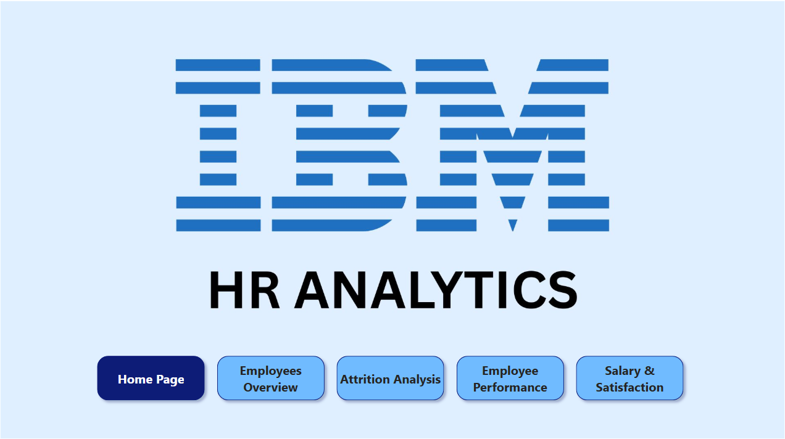

**# 💼 IBM HR Analytics Power BI Dashboard**

This project analyzes IBM HR data using Power BI to uncover insights on employee attrition, satisfaction, performance, salary trends, and career progression. The goal is to help HR teams make informed, data-driven decisions.

---

**## Power BI Dashboard**

View Dashboard Here: https://app.powerbi.com/view?r=eyJrIjoiYWMyYzg5YzItYTI0NS00YjJlLTkyZmMtYWFhNDM5YmIyZjUxIiwidCI6ImRhYTU5MmNhLWRlN2ItNGM1NC04ODM2LTkxYTY2OTBmZTE5NyJ9

---

**## 📊 Project Overview**

**Dataset**: [IBM HR Analytics Employee Attrition & Performance Dataset](https://www.kaggle.com/datasets/pavansubhasht/ibm-hr-analytics-attrition-dataset)

**Tool Used**: Power BI

**Focus Areas**:
- Attrition Analysis
- Workforce Demographics
- Performance & Training
- Salary & Satisfaction
- Career Growth & Promotions

---

**## 📁 Pages in Dashboard**

### 📄 Page 0: Home Page

### 📄 Page 1: Employees Overview
- KPIs: Total Employees, Attrition Rate, Avg Monthly Income
- Overview cards and summary charts

### 📄 Page 2: Attrition Analysis
- Attrition rate by department, gender, age
- Heatmap of attrition by age & job role
- Pie chart for attrition breakdown

### 📄 Page 3: Employee Performance
- Bar chart: Avg performance by department
- Scatter plot: Training vs Performance
- Job satisfaction by role
- KPI: Avg training sessions

### 📄 Page 4: Salary & Satisfaction
- Box plot: Monthly income by job role
- Bar chart: Environment satisfaction by department
- Gauge: Avg job satisfaction
- Pie: Relationship satisfaction

---

**## 🛠 Skills Used**

- Power BI (DAX, Power Query, Visuals)
- Data Transformation
- Data Modeling
- KPI & Metrics Creation
- Visual Storytelling
- Drill-down & Interactivity

---

**## 📌 Key Insights**

- High attrition rates found in specific departments and age groups.
- Training has a positive correlation with performance.
- Salary distribution varies widely by role and experience.
- Some departments show delayed promotions and low satisfaction.

---

**## 📂 Dataset Features**

- Employee demographics (Age, Gender, Marital Status)
- Job and performance data
- Satisfaction and environment scores
- Training and promotion history
- Income and overtime details

---

**## 📥 How to Use**

1. Clone this repo or download the `.pbix` file.
2. Open it with Power BI Desktop.
3. Explore interactive pages using slicers and filters.

---

